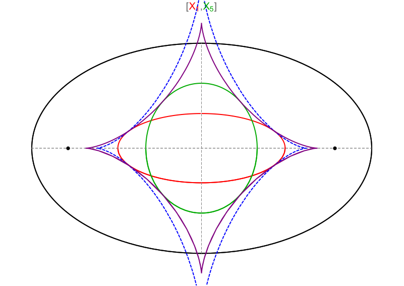

## Triple tangency {-}

As shown below, for collinear Centers $X_i,i=2,5,12$ the envelope is triply-tangent to their loci. However, it is not tangent to the locus of $X_{11}$, also collinear.

```{r,echo=F,fig.align="center",out.width="50%"}

```

## Envelope of X(1),X(100),X(88) {-}

These three points are known to be collinear. Shown elsewhere [@garcia2020-ellipses] was the fact that the locus of $X_1$ is an ellipse and those of both $X_{100}$ and $X_{88}$ are on the Elliptic Billiard. Parametrize the 3-periodic family by its first vertex $P_1(t)=[a\cos{t},b\sin{t}],0{\leq}2\pi$. As shown in this [video](https://youtu.be/nJLp--JjDZU), $X_1$ will turn in the same direction as $P_1$, whereas $X_{100}$ will turn counter to $P_1$. The nature of this direction is not understood. Furthermore, the motion of $X_{88}$ is more complicated.

Let $a_{88}=(\sqrt{2\sqrt{2}+6}\,)/2\simeq{1.485}$. The corresponding motion of $X_{88}$ will be one of three types:

- $a/b<a_{88}$: monotonic and opposite to $P_1(t)$, slowing down near EB vertices
- $a/b=a_{88}$: same, but with instantaneous stops at the EB vertices.
- $a/b>a_{88}$: same but with reverse velocity phases near the vertices.

Equivalently, $X_{88}$ is stationary when the instantaneous envelope of line $X_1X_{100}$ is $X_{88}$ itself. Below we show that for $a/b$ less than, equal, or greater than $a_{88}$, the envelope will be entirely inside, touch the EB vertices, or pierce sideways through the Billiard, respectively, as shown on a [video](https://youtu.be/nJLp--JjDZU).

```{r,echo=F,fig.align="center",out.width="75%"}

```

## Envelope of Isogonal and Isotomic Axes {-}

Given a triangle ABC, the isogonal and isotomic conjugate of any line on its plane is a circumellipse [@mw]. If the Elliptic Billiard is regarded as the stationary circumellipse to the 3-periodic family, the Antiorthic Axis and Gergonne Line [@mw] are its isogonal and isotomic conugates, respectively [@etc]. As shown on this [video](https://youtu.be/Q7l6_Z4IyEI), these lines envelop the *elliptic* locus of $X_{1155}$ and $X_{908}$, respectively. This is remarkable since as seen above, most point pairs produce multi-cuspid envelopes (astroid-like).

```{r,echo=F,fig.align="center",out.width="75%"}

```

## Astroidal Ellipse Evolute

The evolute of an ellipse with axes $a,b$ is the envelope of its normals. It is given by the following astroid-like curve [@mw]:

$$
\begin{align*}
x(t)=&\frac{c^2}{a}\cos^3(t)\\
y(t)=&-\frac{c^2}{b}\sin^3(t)\\
c^2=&a^2-b^2
\end{align*}
$$

We have found this evolute to be tangent to the locus of $X_1$ for any Billiard aspect ratio. This could be related to the fact that the evolute is the envelope of lines $P_1(t)X_1$, oriented as the normals.

We have found that for none of the envelopes $(X_1,X_j),1<j<100$ generated so far which are tangent to the locus of $X_1$ coincide with the evolute. This could be caused by the fact that $P_1(t)$ is not a Triangle Center.

Shown below is the envelope of $[X_1,X_5]$ (purple), doubly tangent to the two loci, and the EB's evolute (dashed blue). Note they do not coincide.

```{r,echo=F,fig.align="center",out.width="66%"}

```
