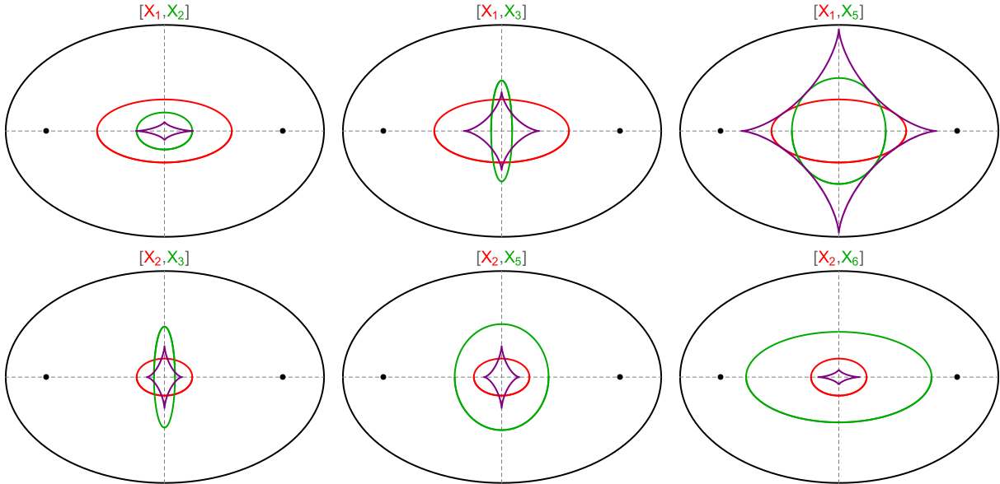

--- 
title: "3-Periodics: Envelope of Triangle Center Pairs"
author: Dan Reznik
date: March, 2020
output:
    bookdown::html_document2:
      theme: united
      css: style.css
      toc_depth: 2
      toc: true
      toc_float:
        toc_collapsed: true
        smooth_scroll: yes
      fig_caption: yes
      number_sections: yes
link-citations: yes
bibliography: [elliptic_billiards_v2.bib,authors_rgk_v1.bib]
csl: computer.csl
---

```{r,echo=F}
knitr::opts_chunk$set(
  cache=T,
  collapse=T,
  comment="#>",
  dpi=300,
  fig.align="center",
  out.width='100%'
)
```

```{r,echo=F,message=F,cache=F,warning=F}
library(tidyverse)
library(fs)
library(slickR)
library(assertthat)
library(knitr)
library(googlesheets4)
library(kableExtra)
source("util.R")
g_url <- "https://dan-reznik.github.io/billiard-envelopes"
```

# Introduction

Consider an Elliptic Billiard (EB) with boundary given by, $a>b>0$:

$$
f(x,y)=\left(\frac{x}{a}\right)^2+\left(\frac{y}{b}\right)^2-1=0
$$

Consider its 1d family of 3-periodics [@reznik2019-intelligencer]. A pair of Kimberling Centers $[X_i,X_j],i{\neq}j$ defines a family of lines. Below we explore the caustic curves they envelop [@mw-envelope], i.e., are instantaneously tangent to. A few examples of loci and envelopes for basic Center pairs appear below (locis in red/green and envelope in purple):

```{r,echo=F,fig.align="center",out.width="75%"}

```

Note: $X_i,i=2,3,4,5$ are collinear and on the Euler Line [@mw]. Pairs thereof generate the (same) Euler Line envelope.


```{r,eval=F,include=F}
dir_ls("pics_env_1618") %>% as.character %>% length
dir_ls("pics_env_svg") %>% as.character %>% length
```

```{r,eval=F,include=F}
setdiff(only_fname(dir_ls("pics_env_svg") %>% as.character),
        only_fname(dir_ls("pics_env_1618") %>% as.character))
```

```{r,eval=F,include=F}
setdiff(only_fname(dir_ls("pics_env_1618") %>% as.character),
        only_fname(dir_ls("pics_env_svg") %>% as.character))
```

```{r,include=F,cache=F}
g_fnames <- as.character(dir_ls(
  #"pics_env_1618"
  "pics_env_svg",
  regexp = "env_\\d{4}_\\d{4}")
  )
g_fnames <- str_c(g_url,"/",g_fnames)
```

```{r,include=F}
df_centers <- tribble(~xi,~xname,
                      1,"Incenter",
                      2,"Barycenter",
                      3,"Circumcenter",
                      4,"Orthocenter",
                      5,"9-Point Center",
                      6,"Symmedian Point",
                      #7,"Gergonne Point",
                      #8,"Nagel Point",
                      #10,"Spieker Center",
                      11,"Feuerbach Point",
                      #12,"X(1)-X(5) Harm. Conjug. of X(11)"
                      )
```

# Envelope Carousels {.tabset .tabset-fade .tabset-pills}

We examine envelopes of lines generate by pairs $[X_i,X_j],i{\in}\{1,2,3,4,5,6,11\},j{\in}(i,100]$ for an EB with $a/b{\simeq}1.618$, the Golden Ratio. Out of these we eliminate pairs collinear with $X_9$, since the latter is stationary at the EB center [@reznik2019-intelligencer].

Color coding:

- Black: billiard
- Red: locus of $X_i$
- Green: locus of $X_j$
- Blue (solid): envelope of $[X_i,X_j]$
- Blue (dashed): the *evolute* of the Billiard, i.e., the envelope of the boundary normals [@mw], a fixed astroid-like curve.

```{r,echo=F,cache=F,results='asis',eval=T} 
res <- map2_chr(df_centers$xi,
                df_centers$xname,
                function(xi,xname) knit_child('envelope_child.Rmd',
                                              envir = environment(),
                                              quiet = TRUE))
cat(res, sep = '\n')
```

# Toward a taxonomy {.tabset .tabset-fade .tabset-pills}

```{r,include=F}
comm_single <- "Notice X(1),X(11) is special at a/b=φ, as the point of tangency coincides with that of intersection. We also noticed almost all pairs containing X(11) have an envelope tangent to a single locus."

df_pairs <- tribble(~title,~pairs,~comment,
                    "No tangency",list(c(1,3),c(1,7),c(1,13),
                                       c(2,3),c(2,4),c(2,5),
                                       c(3,4),c(3,5),c(3,6),
                                       c(4,5),c(4,8),c(4,12)),"",
                    "Single tangency",list(c(1,11),c(1,14),c(1,48),
                                           c(2,11),c(2,14),c(2,35),
                                           c(3,11),c(3,14),c(3,48),
                                           c(4,14),c(5,11)),comm_single,
                    "Dual tangency",list(c(1,5),c(1,12),c(1,17),
                                         c(3,8),c(4,32),
                                         c(5,6),c(5,12),c(5,17),
                                         c(11,48)),"")
df_pairs_nf <- pairs_not_found(df_pairs$pairs,g_fnames)
assert_that(length(df_pairs_nf)==0,
            msg=sprintf("df_pairs not found: %s",df_pairs_nf))
```

```{r,echo=F,cache=F,results='asis'}
res <- pmap_chr(list(df_pairs$title,df_pairs$pairs,df_pairs$comment),
                function(title,pairs,comment)
 knit_child('envelope_child_hand_picked.Rmd',
                                    envir = environment(),
                                    quiet = TRUE))
cat(res, sep = '\n')
```

# Hand-picked "Best-Of" {.tabset .tabset-fade .tabset-pills}

```{r,include=F,cache=F}
df_pairs_hp <- tribble(~title,~pairs,~comment,
                       "Heart-Shaped",list(c(47,52),c(24,59),c(36,50)),"",
                       "Spikeys",list(c(26,53),c(94,100),c(5,53),c(53,59),c(40,92)),"",
                       "X(92) Batman",list(c(5,92),c(23,92),c(31,92),c(62,92)),"",
                       "Quasi-Diamond",list(c(31,65),c(54,83)),"",
                       "Close-Tracking",list(c(4,59),c(36,59),c(49,60),c(99,100)),"",
                       "Multiple Tangents",list(c(23,59),c(88,90),c(51,92)),"",
                       "Misc",list(c(49,91),c(69,99)),"",
                       "X(96) Brazil Flag",list(c(2,96),c(37,96)),""
                       )
df_pairs_hp_nf <- pairs_not_found(df_pairs_hp$pairs,g_fnames)
assert_that(length(df_pairs_hp_nf)==0,
            msg=sprintf("df_pairs_hp not found: %s",df_pairs_hp_nf))
```

```{r,echo=F,cache=F,results='asis'}
res <- pmap_chr(list(df_pairs_hp$title,
                     df_pairs_hp$pairs,
                     df_pairs_hp$comment),
                function(title,pairs,comment)
                  knit_child('envelope_child_hand_picked.Rmd',
                                    envir = environment(),
                                    quiet = TRUE))
cat(res, sep = '\n')
```

<!-- swan envelopes -->
# Swan Envelopes  {.tabset .tabset-fade}

**Note: should a carousel below be empty, click on the right carousel arrow to bring in first image.**

```{r,child="envelopes1618_swans.Rmd"}
```

<!-- research topics -->
# Research Questions  {.tabset .tabset-fade .tabset-pills}
```{r,child="envelopes1618_research.Rmd"}
```

# List of Videos

```{r,include=F,message=F,cache=F}
sheets_id <- Sys.getenv("sheet_id")
df_videos <- sheets_read(sheets_id,sheet="videos") %>%
    # read_csv("Elliptic Billiards Videos.csv") %>%
  mutate(Video1=make_href("v1",Video1),
         Video2=if_else(is.na(Video2),NA_character_,
                        make_href("v2",Video2)),
         Video3=if_else(is.na(Video3),NA_character_,
                        make_href("v3",Video3))) %>%
  unite(urls,starts_with("Video"),sep=", ",remove=T,na.rm=T) %>%
  select("Title",everything())
```

```{r,echo=F,cache=F,results='asis'}
res <- lapply(c("Envelopes"), function(sec) {
  df_filt <- df_videos%>%
    filter(Section==sec)%>%
    select(-id,-Section,-N)
  # print(df_filt)
  knit_child('videos_child_nosubsection.Rmd',
             envir = environment(), quiet = TRUE)
  })
cat(unlist(res), sep = '\n')
```

Javascript set tabset
```{js, echo=FALSE}
$('body').on('shown.bs.tab', function(e) {
  $(e.target).each(function() {
                 .parents('.tabset')
                 .find('.active .slick-slider')
                 .each(function() {
                     this.slick.setPosition()
                 })
             })
});
```


***
`r if (is_html_output()) '# References'`
